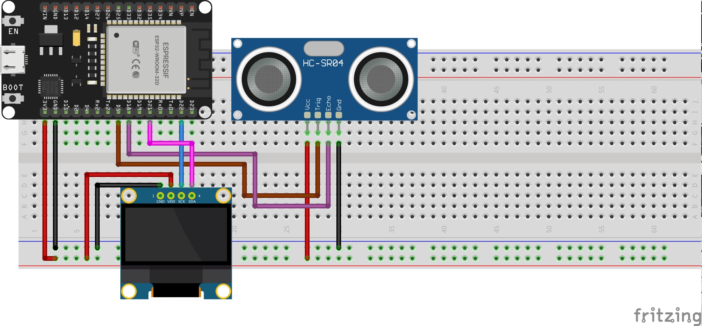

# ESP32 Ultrasonic Sensor and OLED Display Project

This project demonstrates how to use an ESP32 microcontroller to read distance measurements from an ultrasonic sensor and display the results on an OLED screen. Additionally, it includes an LED that blinks when the measured distance is within a certain threshold.

## Table of Contents

- [Introduction](#introduction)
- [Hardware Requirements](#hardware-requirements)
- [Software Requirements](#software-requirements)
- [Circuit Diagram](#circuit-diagram)
- [Installation](#installation)
- [Usage](#usage)
- [Code Explanation](#code-explanation)
- [License](#license)

## Introduction

This project uses an ESP32 microcontroller to interface with an ultrasonic sensor and an OLED display. The ultrasonic sensor measures the distance to an object, and the OLED display shows the distance. If the distance is within a specified threshold, an LED will blink, and an animation will be displayed on the OLED screen.

## Hardware Requirements

- ESP32 Development Board
- Ultrasonic Sensor (e.g., HC-SR04)
- OLED Display (e.g., SSD1306)
- LED
- Breadboard and Jumper Wires

## Software Requirements

- [PlatformIO](https://platformio.org/)
- [Visual Studio Code](https://code.visualstudio.com/)

## Circuit Diagram



Connect the components as follows:

- **Ultrasonic Sensor:**
  - VCC to 5V
  - GND to GND
  - TRIG to GPIO 5
  - ECHO to GPIO 18

- **OLED Display:**
  - VCC to 3.3V
  - GND to GND
  - SCL to GPIO 22
  - SDA to GPIO 21

- **LED:**
  - Builtin LED (GPIO 2)

## Installation

1. Clone the repository:
    ```sh
    git clone https://github.com/yourusername/esp32-ultrasonic-oled.git
    cd esp32-ultrasonic-oled
    ```

2. Open the project in Visual Studio Code with PlatformIO extension installed.

3. Install the required libraries by adding the following to your `platformio.ini` file:
    ```ini
    lib_deps = 
        adafruit/Adafruit GFX Library@^1.11.11
        adafruit/Adafruit SSD1306@^2.5.12
        teckel12/NewPing@^1.9.7
    ```

4. Build and upload the project to your ESP32 board:
    ```sh
    pio run --target upload
    ```

## Usage

1. Connect the ESP32 to your computer via USB.
2. Open the Serial Monitor in PlatformIO with a baud rate of 115200.
3. Observe the distance measurements and the LED blinking based on the distance threshold.

## Code Explanation

### `src/main.cpp`

The main code file initializes the OLED display and sets up the ultrasonic sensor and LED. The `setup` function configures the display and serial communication. The `loop` function continuously reads the distance from the ultrasonic sensor, updates the display, and blinks the LED if the distance is within the threshold.

#### Key Functions:

- `setup()`: Initializes the display, sets the LED pin as output, and starts serial communication.
- `loop()`: Reads the distance, updates the display, and handles LED blinking and animation.

### Libraries Used

- **Adafruit GFX Library**: For graphics functions on the OLED display.
- **Adafruit SSD1306**: For interfacing with the SSD1306 OLED display.
- **NewPing**: For handling the ultrasonic sensor.

## License

This project is licensed under the MIT License. See the [LICENSE](LICENSE) file for details.